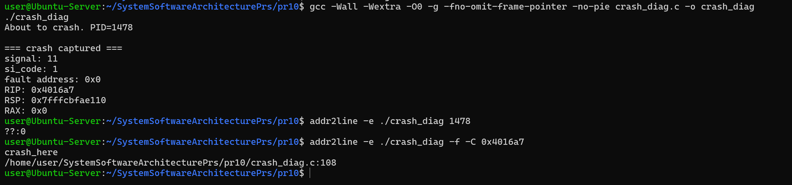
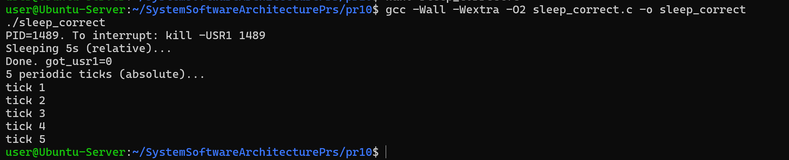
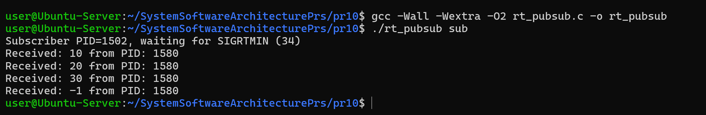
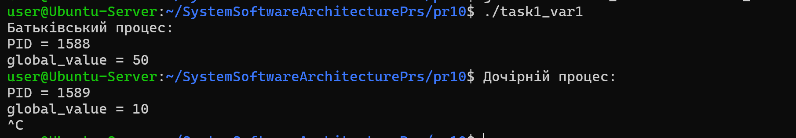

# Практична робота 10 ( Варіант 1 )

## Приклади з лекції 13

## Приклад 1

Дослідити роботу crash handler із використанням SA_SIGINFO та отриманням register dump.

## _Результати_

Було досліджено механізм перехоплення аварійних сигналів у Linux за допомогою sigaction() та прапорця SA_SIGINFO.

Програма обробляє сигнали SIGSEGV, SIGBUS, SIGFPE, SIGILL та SIGABRT, після чого виводить інформацію про помилку:
- номер сигналу
- адресу помилки
- значення регістрів процесора

Також було продемонстровано використання addr2line для визначення місця помилки у вихідному коді.

## Приклад 2

Дослідити коректне використання nanosleep() та clock_nanosleep().

## _Результати_

Було реалізовано приклад правильного використання nanosleep() з обробкою EINTR та повторним запуском сну після сигналу.

Також досліджено використання clock_nanosleep() з абсолютним часом, що дозволяє уникати накопичення затримок (drift) у періодичних задачах.

Програма демонструє роботу сигналів та стабільний періодичний таймер.

## Приклад 3

Дослідити модель publisher-subscriber із використанням real-time signals.

## _Результати_

Було реалізовано просту систему publisher-subscriber із використанням:
- SIGRTMIN
- sigqueue()
- sigwaitinfo()
- sigtimedwait()

Subscriber очікує повідомлення у вигляді сигналів реального часу, а publisher передає цілі числові значення через sigqueue().

Також було досліджено режим роботи з timeout, коли очікування сигналу завершується через певний проміжок часу.

## Завдання 1 (варіант 1)

Створити програму, яка після fork() змінює глобальну змінну у батьківському процесі та перевіряє її значення у дочірньому процесі.

## _Результати_

Було створено програму з глобальною змінною, яка після виклику fork() змінюється лише у батьківському процесі.

У результаті встановлено, що після fork() кожен процес отримує власну копію пам’яті.

Зміна глобальної змінної у батьківському процесі не впливає на значення цієї змінної у дочірньому процесі.