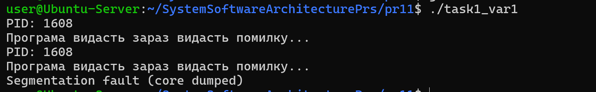
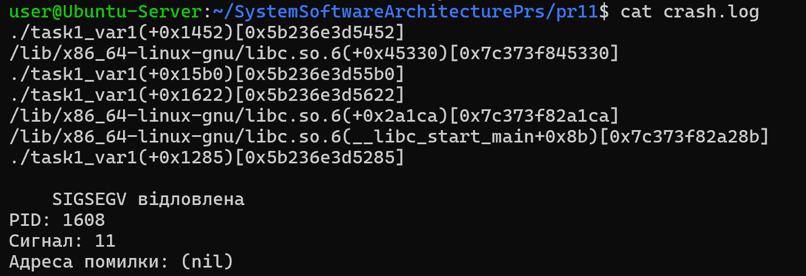

# Практична робота 11 ( Варіант 1 )

## Завдання 1 (Варіант 1)

Напишіть програму, яка ловить сигнал SIGSEGV, зберігає fault address, поточний стек та PID у лог-файл, і намагається перезапустити себе.

## _Результати_

Було реалізовано обробник сигналу SIGSEGV за допомогою sigaction() та прапорця SA_SIGINFO.

Після виникнення помилки сегментації програма:
- зберігає PID процесу
- записує адресу помилки (fault address)
- формує stack trace
- записує інформацію у файл crash.log

Для отримання стеку викликів використано функції backtrace() та backtrace_symbols_fd().

Після запису інформації програма намагається перезапустити себе через execvp().

У результаті було продемонстровано базовий механізм crash handler та автоматичного відновлення процесу після аварійного завершення.