# ПР2 (Варіант 1)
## Завдання 2.1 (ЗАГАЛЬНЕ ДЛЯ ВСІХ)
Напишіть програму для визначення моменту, коли time_t
закінчиться. Дослідіть, які зміни відбуваються в залежності від 32- та
64-бітної архітектури. Дослідіть сегменти виконуваного файлу.
## _Розв'язання_
### _Дослідіть, які зміни відбуваються в залежності від 32- та 64-бітної архітектури._
___ 
В 32-бітній архітектурі time_t зазвичай реалізується як signed 32-бітний цілий тип (наприклад, int), що дозволяє зберігати значення до 2^31 - 1 (близько 2,1 мільярда), тому переповнення відбувається 19 січня 2038 року о 03:14:07 UTC, коли лічильник секунд від епохи Unix (1 січня 1970) перевищить цей ліміт і "обернеться" в негативне значення, викликаючи помилки в датах і часі. Це стається через обмежений діапазон бітів, який не може вмістити більші числа без втрати точності чи переповнення. У 64-бітній архітектурі time_t типово є signed 64-бітним (наприклад, long long), з діапазоном до 2^63 - 1 (близько 9,2 квінтильйона), тому переповнення відбудеться лише через мільярди років (приблизно 292 мільярди років після епохи), роблячи проблему практично неактуальною. Різниця виникає через дизайн процесорів і ABI (Application Binary Interface), де 64-бітні системи підтримують більші регістри та адресацію, дозволяючи використовувати розширені типи даних для уникнення раннього переповнення, тоді як 32-бітні обмежені апаратно для сумісності зі старішим ПЗ.

## _Результати_

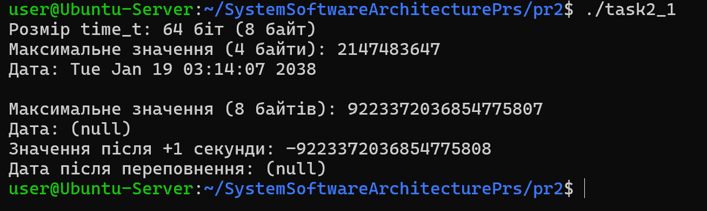
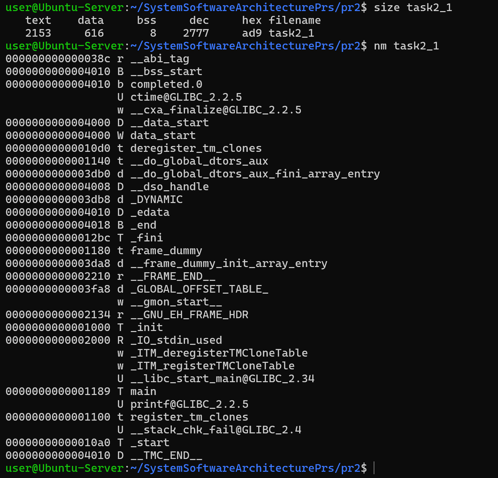
## Завдання 2.2
Розгляньте сегменти у виконуваному файлі.
1. Скомпілюйте програму &quot;hello world&quot;, запустіть ls -l для
виконуваного файлу, щоб отримати його загальний розмір, і
запустіть size, щоб отримати розміри сегментів всередині нього.
2. Додайте оголошення глобального масиву із 1000 int,
перекомпілюйте й повторіть вимірювання. Зверніть увагу на
відмінності.
3. Тепер додайте початкове значення в оголошення масиву
(пам’ятайте, що C не змушує вас вказувати значення для кожного
елемента масиву в ініціалізаторі). Це перемістить масив із сегмента BSS у сегмент даних. Повторіть вимірювання. Зверніть увагу на
різницю.
4. Тепер додайте оголошення великого масиву в локальну функцію.
Оголосіть другий великий локальний масив з ініціалізатором.
Повторіть вимірювання. Дані розташовуються всередині функцій,
залишаючись у виконуваному файлі? Яка різниця, якщо масив
ініціалізований чи ні?
5. Які зміни відбуваються з розмірами файлів і сегментів, якщо ви
компілюєте для налагодження? Для максимальної оптимізації?
Проаналізуйте результати, щоб переконатися, що:
    * сегмент даних зберігається у виконуваному файлі;
    * сегмент BSS не зберігається у виконуваному файлі (за винятком
    примітки щодо його вимог до розміру часу виконання);
    * текстовий сегмент більшою мірою піддається перевіркам
    оптимізації;
    * на розмір файлу a.out впливає компіляція для налагодження, але не
    сегменти.

## _Розв'язання_
### _Скомпілюйте програму &quot;hello world&quot;, запустіть ls -l для виконуваного файлу, щоб отримати його загальний розмір, і запустіть size, щоб отримати розміри сегментів всередині нього._
---
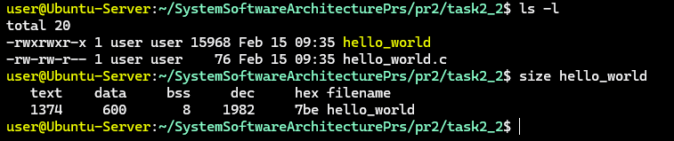

### _Додайте оголошення глобального масиву із 1000 int, перекомпілюйте й повторіть вимірювання. Зверніть увагу на відмінності._
---
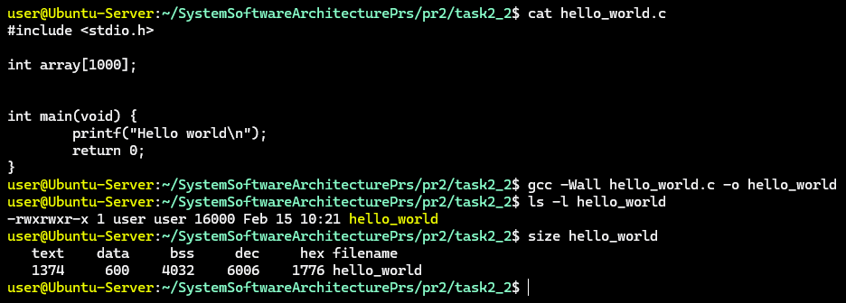
1. Як можна побачити при використанні 'ls -l hello_world' розмір файлу у нас не зріс, масив, який я додав не ініціалізований тому знаходиться в сегменті bss, а цей сегмент не впливає на розмір файлу.
2. При 'size hello_world' в сегменті bss у нас додалось 4024 байтів, із яких 4000 це наш масив.

### _Тепер додайте початкове значення в оголошення масиву (пам’ятайте, що C не змушує вас вказувати значення для кожного елемента масиву в ініціалізаторі). Це перемістить масив із сегмента BSS у сегмент даних. Повторіть вимірювання. Зверніть увагу на різницю._
---
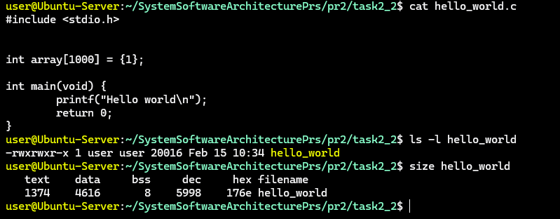
1. Як можна побачити при використанні 'ls -l hello_world' розмір файлу у нас зріс на 4000 байтів.
2. При 'size hello_world' в сегменті bss у нас пропало 4024 байтів, а в сегмент data додалося 4016.

### _Тепер додайте оголошення великого масиву в локальну функцію. Оголосіть другий великий локальний масив з ініціалізатором. Повторіть вимірювання. Дані розташовуються всередині функцій, залишаючись у виконуваному файлі? Яка різниця, якщо масив ініціалізований чи ні?_
---
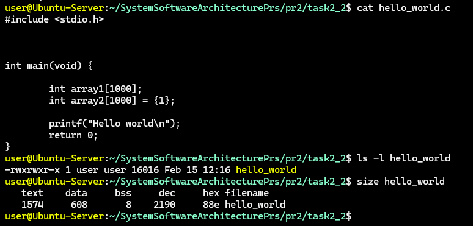
1. Можемо побачити що розмір виконуваного файлу зменшився до початкового 16000 байтів, також всі сегменти також зменшилися до початкових розмірів. Це відбулося тому, що локальні змінні які були ініціалізовані розміщуються в Stack розділі пам'яті а вона виділяється під час роботи, а не під час компіляції файлу. Також різниці між ініціалізованим та ініціалізованим масивом немає.

### _Які зміни відбуваються з розмірами файлів і сегментів, якщо ви компілюєте для налагодження? Для максимальної оптимізації? Проаналізуйте результати, щоб переконатися, що: сегмент даних зберігається у виконуваному файлі; сегмент BSS не  зберігається у виконуваному файлі (за винятком примітки щодо його вимог до розміру часу виконання); текстовий сегмент більшою мірою піддається перевіркам оптимізації; на розмір файлу a.out впливає компіляція для налагодження, але не сегменти._
---
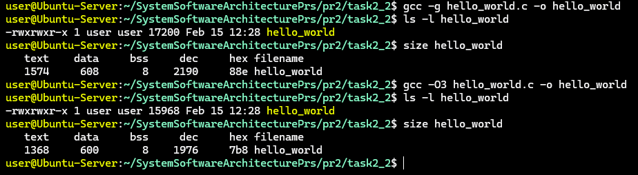
1. При компіляції з -g параметром збільшився розмір файлу, але розмір сегментів не змінився. При компіляції з -O3 розмір файлі остався 16000 байтів, а в сегментах зменшився тільки розмір сегменту text.

2. Отже проаналізувавши результати можна зробити висновки що:
* Сегменти даних фізично зберігаються на дискі, щоб система змогла прочитати початкові значенння змінних.
* Сегмент BSS дійсно не зберігається в виконуваному файлі, це підтверджувалось при перевірці розміру файлу.

## Завдання 2.3

Скомпілюйте й запустіть тестову програму, щоб визначити приблизне
розташування стека у вашій системі:
```
#include <stdio.h>;
int main() {
int i;
printf("The stack top is near %p\n";, &i);
return 0;
}
```
Знайдіть розташування сегментів даних і тексту, а також купи всередині
сегмента даних, оголосіть змінні, які будуть поміщені в ці сегменти, і
виведіть їхні адреси.
Збільшіть розмір стека, викликавши функцію й оголосивши кілька
великих локальних масивів. Яка зараз адреса вершини стека?

Примітка: стек може розташовуватися за різними адресами на різних
архітектурах та різних ОС. Хоча ми говоримо про вершину стека, на
більшості процесорів стек зростає вниз, до пам’яті з меншими значеннями
адрес.

## _Розв'язання_
### _Скомпілюйте й запустіть тестову програму, щоб визначити приблизне розташування стека у вашій системі._
---
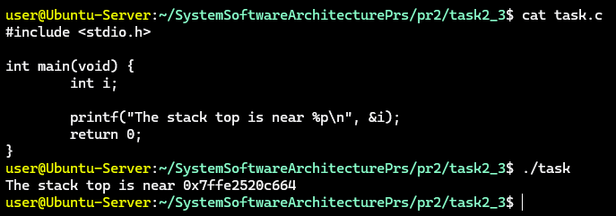

### _Знайдіть розташування сегментів даних і тексту, а також купи всередині сегмента даних, оголосіть змінні, які будуть поміщені в ці сегменти, і виведіть їхні адреси._
---
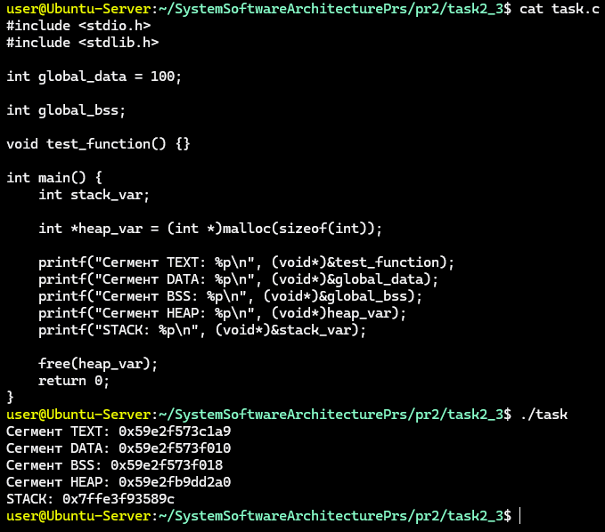

### _Збільшіть розмір стека, викликавши функцію й оголосивши кілька великих локальних масивів. Яка зараз адреса вершини стека?_
---
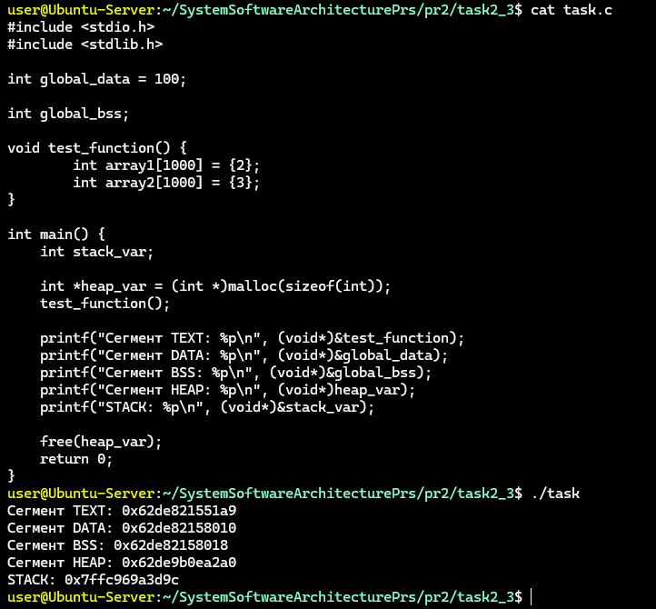
    
## Завдання 2.4

```
Ваше завдання – дослідити стек процесу або пригадати, як це робиться. Ви
можете:
● Автоматично за допомогою утиліти gstack.
● Вручну за допомогою налагоджувача GDB.
Користувачі Ubuntu можуть зіткнутися з проблемою: на момент написання
(Ubuntu 18.04) gstack, схоже, не був доступний (альтернативою може бути
pstack). Якщо gstack не працює, використовуйте другий метод – через
GDB, як показано нижче.
Спочатку подивіться на стек за допомогою gstack(1). Нижче наведений
приклад стека bash (аргументом команди є PID процесу):
$ gstack 14654
#0 0x00007f359ec7ee7a in waitpid () from /lib64/libc.so.6
#1 0x000056474b4b41d9 in waitchild.isra ()
#2 0x000056474b4b595d in wait_for ()
#3 0x000056474b4a5033 in execute_command_internal ()
#4 0x000056474b4a5c22 in execute_command ()
#5 0x000056474b48f252 in reader_loop ()
#6 0x000056474b48dd32 in main ()
$
Розбір стека:
● Номер кадру стека відображається ліворуч перед символом #.
● Кадр #0 – це найнижчий кадр. Читайте стек знизу вверх (тобто від
main() – кадр #6 – до waitpid() – кадр #0).
● Якщо процес багатопотоковий, gstack покаже стек кожного потоку
окремо.
Аналіз стека в режимі користувача через GDB

Щоб переглянути стек процесу вручну, використовуйте GDB,
приєднавшись до процесу.
Нижче наведена невелика тестова програма на C, що виконує кілька
вкладених викликів функцій. Граф викликів виглядає так:
main() --&gt; foo() --&gt; bar() --&gt; bar_is_now_closed() --&gt; pause()
Системний виклик pause() – це приклад блокуючого виклику. Він
переводить викликаючий процес у сплячий режим, очікуючи (або
блокуючи) сигнал. У цьому випадку процес блокується, поки не отримає
будь-який сигнал.
#include &lt;stdio.h&gt;
#include &lt;stdlib.h&gt;
#include &lt;unistd.h&gt;
#include &lt;sys/types.h&gt;
#define MSG &quot;In function %20s; &amp;localvar = %p\n&quot;
static void bar_is_now_closed(void) {
int localvar = 5;
printf(MSG, __FUNCTION__, &amp;localvar);
printf(&quot;\n Now blocking on pause()...\n&quot;);
pause();
}
static void bar(void) {
int localvar = 5;
printf(MSG, __FUNCTION__, &amp;localvar);
bar_is_now_closed();
}
static void foo(void) {
int localvar = 5;
printf(MSG, __FUNCTION__, &amp;localvar);
bar();
}
int main(int argc, char **argv) {
int localvar = 5;
printf(MSG, __FUNCTION__, &amp;localvar);
foo();
exit(EXIT_SUCCESS);
}

Тепер відкрийте GDB
У ньому підключіться (attach) до процесу (в наведеному прикладі PID =
24957) і дослідіть стек за допомогою команди backtrace (bt):
$ gdb --quiet
(gdb) attach 24957
Attaching to process 24957
Reading symbols from &lt;...&gt;/hspl/unit2/stacker...done.
Reading symbols from /lib64/libc.so.6...Reading symbols from
/usr/lib/debug/usr/lib64/libc-2.26.so.debug...done.
done.
Reading symbols from /lib64/ld-linux-x86-64.so.2...Reading symbols
...
(gdb) bt
...
Примітка: В Ubuntu, через питання безпеки, GDB не дозволяє
підключатися до довільного процесу. Це можна обійти, запустивши GDB
від імені користувача root.

Аналіз того ж процесу через gstack
$ gstack 24957
...

gstack — це, по суті, оболонковий скрипт (wrapper shell script), який
неінтерактивно викликає GDB і запускає команду backtrace, яку ви
щойно використали.
Завдання: Ознайомтеся з виводом gstack і порівняйте його з GDB.
```
## _Розв'язання_

Компілюємо та запускаємо файл з кодом:
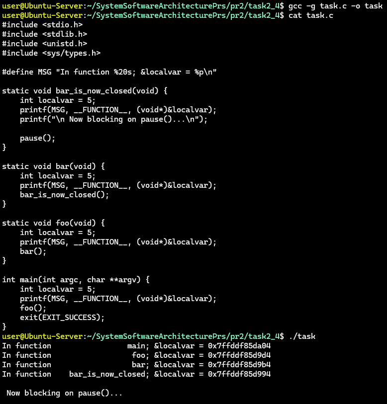

В новому вікні дізнаємося PID процесу:<br>
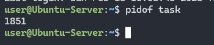

Тепер щоб використати GDB потрібно його встановити (якщо немає):
```
sudo apt install gdb
```
Тепер можемо підключитися до процесу та дослідити стек:
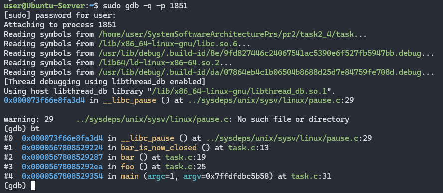
    
Тепер щоб використати pstack потрібно його встановити (якщо немає):
```
sudo apt install pstack
```  

При виклиці sudo pstack 1851, бачимо такуж картину як і при GDB backtrace, оскільки pstack це звичайна обгортка яка викликає GDB:
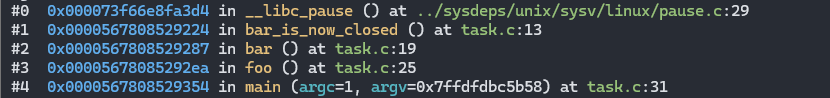

## Завдання 2.5
Відомо, що при виклику процедур і поверненні з них процесор
використовує стек.Чи можна в такій схемі обійтися без лічильника команд
(IP), використовуючи замість нього вершину стека? Обґрунтуйте свою
відповідь та наведіть приклади.

## _Розв'зання_

Теоретично таку схему можна реалізувати в межах стекової архітектури, де кожна інструкція після виконання виштовхується зі стека, автоматично роблячи наступну команду вершиною. Однак на практиці це вкрай неефективно, оскільки відсутність окремого лічильника команд робить неможливим повторне використання коду. У класичній архітектурі лічильник команд дозволяє багаторазово звертатися до однієї і тієї ж ділянки пам'яті, що є основою для роботи циклів та функцій. Якщо ж вершина стека сама є інструкцією, то для створення циклу програмі довелося б постійно копіювати тіло циклу назад у стек, що призвело б до величезних витрат пам'яті та часу. Крім того, така модель змішує логіку керування з даними, змушуючи розробника постійно перекладати команди, щоб дістатися до значень змінних, розташованих глибше. Таким чином, лічильник команд необхідний для того, щоб відокремити незмінний код від динамічних даних стека, забезпечуючи стабільну роботу та можливість оптимізації сучасних процесорів.

## Завдання 2.6 ПО ВАРІАНТАХ (Завдання 1)
Напишіть програму, що визначає максимально можливий розмір сегмента кучі.
## _Результат_

