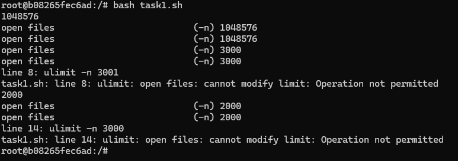
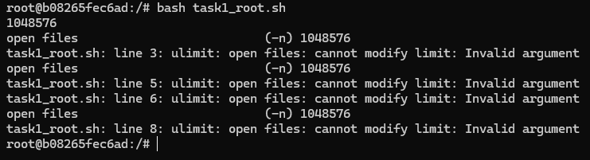
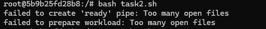
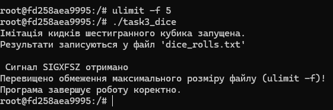
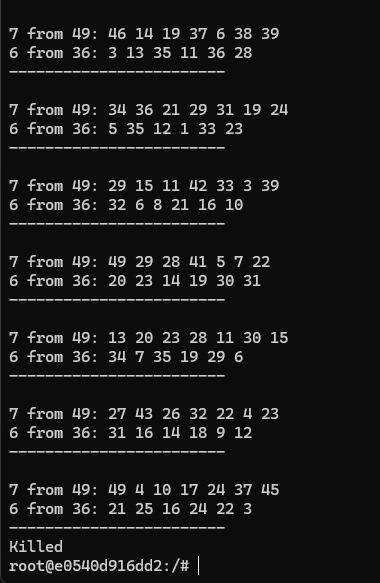
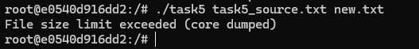
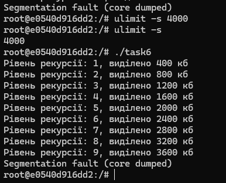

# Практична робота 3: Дослідження обмежень ресурсів у середовищі Docker (Варіант 1)
## Встановлюємо Docker
Для встановлення вводимо ці дві команди
```
sudo apt-get update
sudo apt install docker.io
```

## Завдання 3.1

Запустіть Docker-контейнер і поекспериментуйте з максимальним лімітом ресурсів відкритих файлів. Для цього виконайте команди у вказаному порядку:

```
$ ulimit -n
$ ulimit -aS | grep "open files"
$ ulimit -aH | grep "open files"
$ ulimit -n 3000
$ ulimit -aS | grep "open files"
$ ulimit -aH | grep "open files"
$ ulimit -n 3001
$ ulimit -n 2000
$ ulimit -n
$ ulimit -aS | grep "open files"
$ ulimit -aH | grep "open files"
$ ulimit -n 3000
```

Як наступне вправу, повторіть перераховані команди з root-правами.

## _Результати_
(Без root-прав)



Як бачимо нам не вистачає прав щоб виконати команди строкі 8 та 14, це відбувається через те що, ми попередніми командами самі обмежили собі ліміти відкриття файлів і тим самим встановили жорсткій ліміт. Коли ми намагаємося уже його перевищити, то нам не вдасться зробити, але знизити можемо.

(З root-правами)



У ході дослідження було виявлено, що стандартний Docker-контейнер обмежує можливість зміни системних лімітів (ulimit) навіть для користувача root. Це підтверджується помилкою Invalid argument. Для повноцінного керування ресурсами від імені root необхідні додаткові системні привілеї (SYS_RESOURCE), що є частиною механізму ізоляції та безпеки Docker.


## Завдання 3.2
У Docker-контейнері встановіть утиліту perf(1). Поекспериментуйте з досягненням процесом встановленого 
ліміту.

##  _Результати_

Вставновити perf:
```
apt update
apt install -y linux-tools-generic
```


Під час експерименту з утилітою perf було встановлено критично низький ліміт відкритих файлів (ulimit -n 4). Результат показав, що обмеження ресурсів у Docker-контейнері впливає не лише на цільовий процес (find), а й на самі інструменти моніторингу. Утиліта perf не змогла ініціалізувати робоче середовище (failed to create 'ready' pipe).

## Завдання 3.3
Напишіть програму, що імітує кидання шестигранного кубика. Імітуйте кидки, результати записуйте у файл, для якого попередньо встановлено обмеження на його максимальний розмір (max file size). Коректно обробіть ситуацію перевищення ліміту.


## _Результати_


Отже, програма безперервно кидає кубик і записує результат у dice_rolls.txt. Коли розмір файлу досягає ліміту ulimit -f 5, ядро надсилає сигнал SIGXFSZ.

## Завдання 3.4
Напишіть програму, що імітує лотерею, вибираючи 7 різних цілих чисел у діапазоні від 1 до 49 і ще 6 з 36. Встановіть обмеження на час ЦП (max CPU time) і генеруйте результати вибору чисел (7 із 49, 6 із 36). Обробіть ситуацію, коли ліміт ресурсу вичерпано.

## _Результати_


Отже, після встановлення ліміту на час ЦП ulimit -t 1, встригла згенерувати білети, а коли ліміт часу був вичерпаний ядро надіслало SIGXCPU і програма завдяки обробленю цого випадку завершилася.

## Завдання 3.5

Напишіть програму для копіювання одного іменованого файлу в інший. Імена файлів передаються у вигляді аргументів.
Програма має:
 * перевіряти, чи передано два аргументи, інакше виводити "Program need two arguments";
 * перевіряти доступність першого файлу для читання, інакше виводити "Cannot open file .... for reading";
 * перевіряти доступність другого файлу для запису, інакше виводити "Cannot open file .... for writing";
 * обробляти ситуацію перевищення обмеження на розмір файлу.

## _Результати_
Запуска програми:
```
ulimit -f 1
./task5 task5_source.txt <your destination file .txt>
```



Перед запуском програми був встановлений ліміт ulimit -f 1, тобто обмеження в 512 байт на розмір файлу, в ході копіювання файлу task5_source.txt розміром 3000+ байт, програма перевищила ліміт і зупинилася.

## Завдання 3.6
Напишіть програму, що демонструє використання обмеження (max stack segment size). Підказка: рекурсивна програма активно використовує стек.

## _Результати_



Перед викликом рекурсії я прописав `ulimit -s 4000`, щоб обмежити розмір стеку до 4000 кілобайтів. Як бачимо програма за кожний рекурсивний виклик виділяє по 400 кілобайтів. На 10 рекурсивному виклиці відбулося вичерпання пам'яті стеку.


## Завдання 3.1 (По варіантах, варіант 1)
Написати програму, яка створює багато потоків та перевірити вплив ulimit -u.


