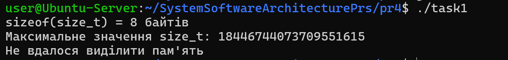
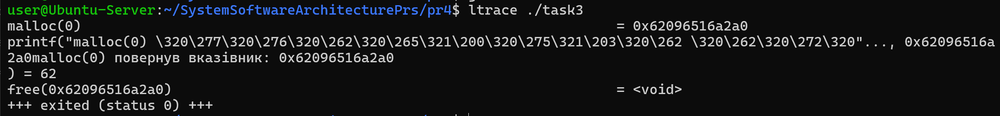
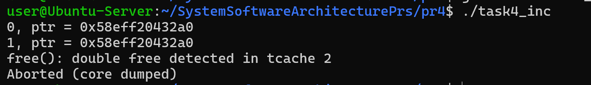
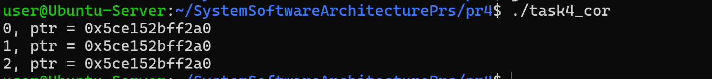
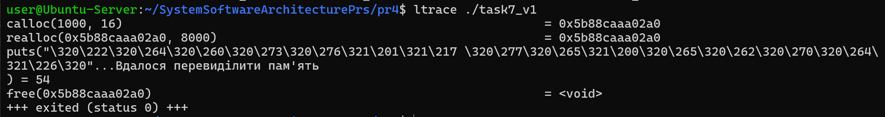
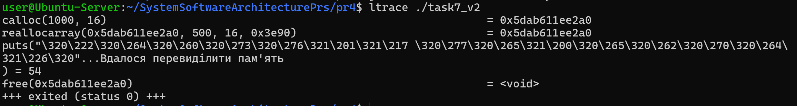

# Практична робота 4

## Завдання ЗАГАЛЬНЕ ДЛЯ ВСІХ

## Завдання 4.1

Скільки пам’яті може виділити malloc(3) за один виклик?

Параметр malloc(3) є цілим числом типу даних size_t, тому логічно максимальне число, яке можна передати як параметр malloc(3), — це максимальне значення size_t на платформі (sizeof(size_t)). У 64-бітній Linux size_t становить 8 байтів, тобто 8 * 8 = 64 біти. Відповідно, максимальний обсяг пам’яті, який може бути виділений за один виклик malloc(3), дорівнює 2^64. Спробуйте запустити код на x86_64 та x86. Чому теоретично максимальний обсяг складає 8 ексабайт, а не 16?


## _Результати_


Було проаналізовано максимальний розмір пам’яті, який може бути переданий у функцію malloc(). Параметр цієї функції має тип size_t. На 64-бітній архітектурі size_t займає 8 байт (64 біти), тому теоретично максимальний розмір виділення становить 
2^64 − 1 байт (≈16 EB).

Проте в реальних реалізаціях стандартної бібліотеки C (наприклад glibc) максимальний розмір обмежений значенням PTRDIFF_MAX, яке дорівнює 
2^63 − 1. Це пов’язано з тим, що різниця між вказівниками обчислюється типом ptrdiff_t (знакове 64-бітне число), і більший розмір може призвести до переповнення під час арифметики з вказівниками.

Таким чином, практично максимальний обсяг пам’яті, який може бути виділений одним викликом malloc() на x86_64, становить приблизно 8 ексабайт, а не 16.


## Завдання 4.2

Що станеться, якщо передати malloc(3) від’ємний аргумент? Напишіть тестовий випадок, який обчислює кількість виділених байтів за формулою num = xa * xb. Що буде, якщо num оголошене як цілочисельна змінна зі знаком, а результат множення призведе до переповнення? Як себе поведе malloc(3)? Запустіть програму на x86_64 і x86.


## _Результати_


Оскільки параметр malloc() має тип size_t, який є беззнаковим, від’ємне значення автоматично перетворюється у дуже велике додатне число. У тестовій програмі кількість пам’яті обчислюється за формулою num = xa * xb, де змінна num оголошена як знаковий тип int. При множенні великих значень відбувається переповнення цілого числа, через що num може отримати від’ємне значення. Після передачі цього значення у malloc() воно перетворюється у тип size_t, що призводить до спроби виділити дуже великий обсяг пам’яті. У результаті malloc() повертає NULL, оскільки система не може виділити такий обсяг пам’яті. Поведінка програми є однаковою на архітектурах x86 та x86_64.

## Завдання 4.3

Що станеться, якщо використати malloc(0)? Напишіть тестовий випадок, у якому malloc(3) повертає NULL або вказівник, що не є NULL, і який можна передати у free(). Відкомпілюйте та запустіть через ltrace. Поясніть поведінку програми.


## _Результати_


При виклику malloc(0) стандарт мови C дозволяє дві можливі поведінки: функція може повернути NULL або унікальний вказівник, який дозволено передати у free(). У тестовій програмі виконується виклик malloc(0) і перевіряється отриманий результат. Під час запуску з використанням ltrace видно, що функція malloc() викликається з аргументом 0 і може повернути ненульовий вказівник. Такий вказівник не повинен використовуватися для доступу до пам’яті, але його дозволено передати у free(). Це пояснюється тим, що стандарт не зобов’язує виділяти реальний блок пам’яті для нульового розміру, але дозволяє реалізації повернути спеціальний вказівник для коректного подальшого звільнення.


## Завдання 4.4

Чи є помилки у такому коді?
```
void *ptr = NULL;
while (<some-condition-is-true>) {
    if (!ptr)
        ptr = malloc(n);
    [... <використання 'ptr'> ...]
    free(ptr);
}
```
Напишіть тестовий випадок, який продемонструє проблему та правильний варіант коду.


## _Результати_

_Чи є помилки у такому коді?_

Так помилка є. Після виклику free вказівник ptr не стає NULL, а продовжує містити стару адресу (dangling pointer). Тому на наступній ітерації умова if (!ptr) буде хибною, і malloc більше не викличеться. У результаті програма може повторно використовувати вже звільнену пам’ять (use-after-free).



На другій ітерації ptr вже звільнений, але не дорівнює NULL, тому malloc() не викликається, і програма працює з уже звільненою пам’яттю.



Тут після free(ptr) вказівник обнуляється, тому на наступній ітерації умова if (!ptr) стане істинною і пам’ять буде виділена знову.

## Завдання 4.5

Що станеться, якщо realloc(3) не зможе виділити пам’ять? Напишіть тестовий випадок, що демонструє цей сценарій.

## _Результати_


Якщо realloc() не може виділити нову пам’ять, вона повертає NULL, але початковий блок пам’яті залишається дійсним і повинен бути звільнений програмою.

## Завдання 4.6

Якщо realloc(3) викликати з NULL або розміром 0, що станеться? Напишіть тестовий випадок.

## _Результати_


Виклик realloc(NULL, size) еквівалентний malloc(size). Виклик realloc(ptr, 0) звільняє пам’ять, аналогічно до free(ptr).    

## Завдання 4.7

Перепишіть наступний код, використовуючи reallocarray(3):
```
struct sbar *ptr, *newptr;
ptr = calloc(1000, sizeof(struct sbar));
newptr = realloc(ptr, 500*sizeof(struct sbar));
```

Порівняйте результати виконання з використанням ltrace.

## _Результати_

realloc:


reallocarray:



reallocarray() є безпечнішою альтернативою realloc(), оскільки перевіряє переповнення при обчисленні n * size, що допомагає уникнути помилок виділення пам’яті.

## Завдання 1 (Завдання ПО ВАРІАНТАХ (Варіант 1))

Реалізувати власний malloc/free на базі brk() для малих блоків і mmap() для великих. Підтримати розбиття та об’єднання вільних блоків. Показати вплив фрагментації.

## _Результати_


Реалізовано спрощений менеджер пам’яті, який відтворює принцип роботи стандартних функцій malloc та free. Для виділення малих блоків використовується системний виклик brk (sbrk), що розширює купу процесу, а для великих блоків застосовується mmap, який виділяє окрему область пам’яті. Кожен блок містить службову структуру з інформацією про розмір, стан та зв’язки із сусідніми блоками. Під час виділення пам’яті система шукає відповідний вільний блок і, якщо він більший за потрібний розмір, розбиває його на частини. Під час звільнення блок позначається як вільний і, за можливості, об’єднується з сусідніми вільними блоками, що дозволяє зменшити фрагментацію пам’яті.