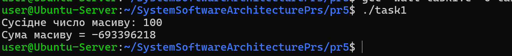
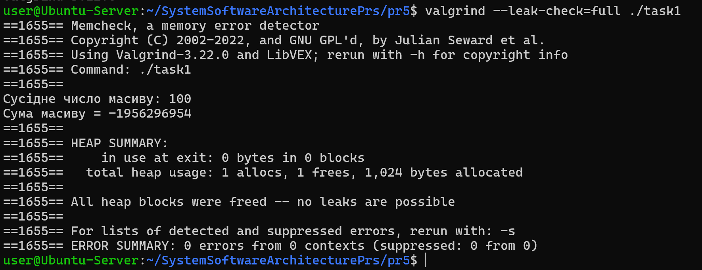

# Практична робота 5: Про помилки роботи з пам’яттю в Linux та засоби їх усунення (Варіант 1)

## Завдання 1 ( Варіант 1 )

Змоделювати читання за межами масиву, яке не викликає segfault, але змінює логіку обчислень через “витік” сусідньої змінної зі стеку.

## _Результати_

У цьому прикладі демонструється помилка читання за межами масиву. Масив arr має три елементи, але цикл проходить чотири ітерації, тому відбувається звернення до arr[3]. У більшості випадків це не викликає аварійного завершення програми, оскільки читається пам’ять зі стеку, яка належить іншій змінній. У цьому випадку може бути прочитане значення змінної secret, що змінює результат обчислення змінної sum. Така ситуація є небезпечною, оскільки помилка може не проявлятися як крах програми, але призводити до неправильних результатів і важких для пошуку логічних помилок.

### Запуск без Valgrind

### Запуск з Valgrind

