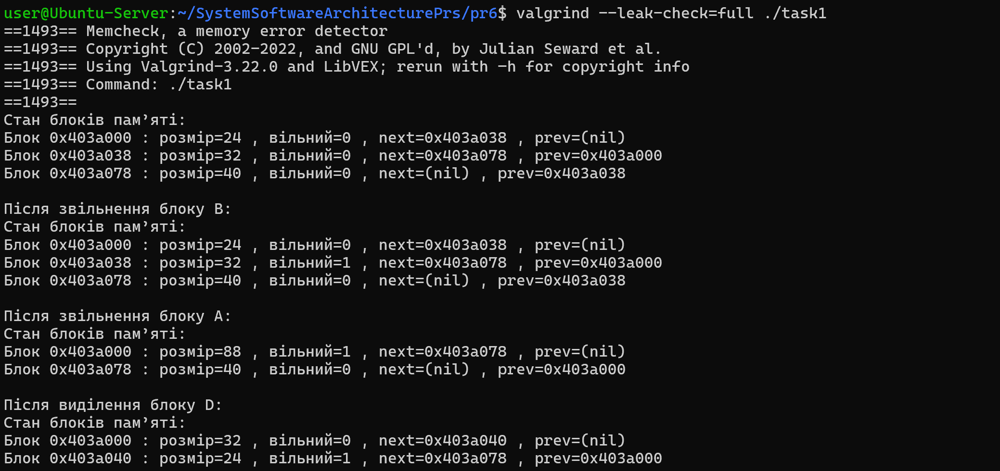
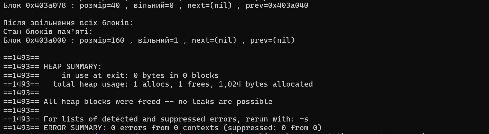

# Практична робота 6: Інструменти налагодження для проблем з пам'яттю. (Варіант 1)

## Завдання 1 ( Варіант 1 )

Реалізувати власний динамічний аллокатор пам’яті на основі sbrk() з підтримкою списку вільних блоків і коалесценції та перевірити його коректність за допомогою Valgrind.

## _Результати_

У програмі створено власні функції my_malloc() і my_free(), які працюють подібно до стандартних malloc() та free(). При виділенні пам’яті спочатку перевіряється, чи існує вільний блок достатнього розміру. Якщо такий блок знайдено, він використовується повторно. Якщо ні — купа розширюється через sbrk().

Після звільнення блоку він не знищується одразу, а позначається як вільний. Якщо поруч є інші вільні блоки, вони об’єднуються в один більший блок, що дозволяє зменшити фрагментацію пам’яті та ефективніше використовувати ресурси.

### Запуск з Valgrind

