# Практична робота 7: Дослідження, моделювання та нестандартні підходи до аналізу процесів, файлових систем, безпеки та ресурсів в Linux. (Варіант 1)

## Завдання 1

Використайте popen(), щоб передати вивід команди rwho (команда UNIX) до more (команда UNIX) у програмі на C.

## _Результати_

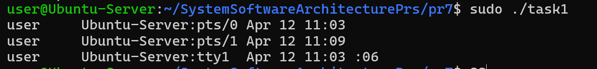

У програмі використано функцію popen(), яка дозволяє виконувати команду оболонки та працювати з її виводом як з файлом. Було реалізовано передачу результату виконання команди rwho до more через конвеєр.

У результаті програма відкриває потік, читає дані з нього та виводить їх у консоль, забезпечуючи посторінковий перегляд.

## Завдання 2

Напишіть програму мовою C, яка імітує команду ls -l в UNIX — виводить список усіх файлів у поточному каталозі та перелічує права доступу тощо.
 (Варіант вирішення, що просто виконує ls -l із вашої програми, — не підходить.)

## _Результати_

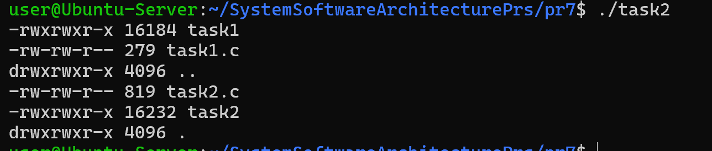

У програмі використано системні виклики для роботи з файловою системою, зокрема opendir(), readdir() та stat(). Для кожного файлу визначаються його права доступу, тип та розмір.

Реалізовано власну функцію для відображення прав доступу у форматі, подібному до ls -l. Програма проходить по всіх файлах каталогу та виводить інформацію про кожен з них.

## Завдання 3

Напишіть програму, яка друкує рядки з файлу, що містять слово, передане як аргумент програми (проста версія утиліти grep в UNIX).

## _Результати_

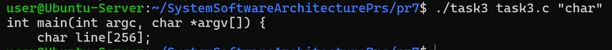

Програма відкриває файл, зчитує його пострічково та перевіряє наявність заданого слова у кожному рядку за допомогою функції strstr().

Якщо слово знайдено, відповідний рядок виводиться у консоль. Таким чином реалізовано базову функціональність пошуку тексту у файлі.

## Завдання 4

Напишіть програму, яка виводить список файлів, заданих у вигляді аргументів, з зупинкою кожні 20 рядків, доки не буде натиснута клавіша (спрощена версія утиліти more в UNIX).

## _Результати_

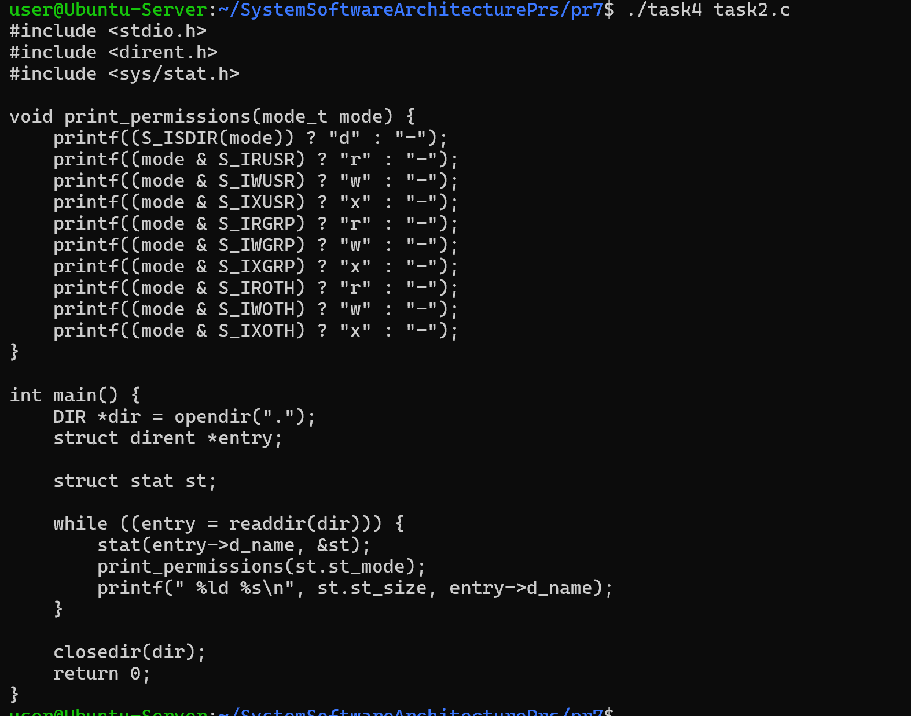

Програма читає файл пострічково та веде підрахунок виведених рядків. Після кожних 20 рядків виконання призупиняється до натискання клавіші користувачем.

## Завдання 5

Напишіть програму, яка перелічує всі файли в поточному каталозі та всі файли в підкаталогах.

## _Результати_

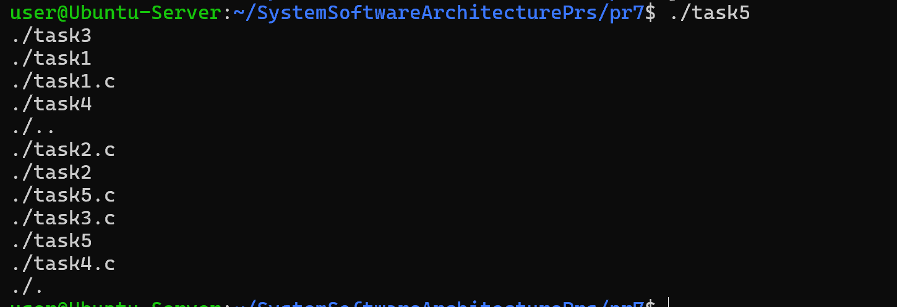

Було реалізовано рекурсивний обхід файлової системи. Програма відкриває каталог, виводить його вміст та для кожного підкаталогу викликає саму себе.

## Завдання 6

Напишіть програму, яка перелічує лише підкаталоги у алфавітному порядку.

## _Результати_

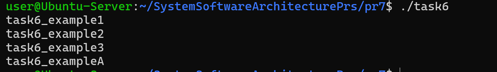

Програма зчитує вміст поточного каталогу та відбирає лише ті елементи, які є підкаталогами. Отриманий список сортується за допомогою функції qsort().

У результаті підкаталоги виводяться у відсортованому алфавітному порядку.

## Завдання 7

Напишіть програму, яка показує користувачу всі його/її вихідні програми на C, а потім в інтерактивному режимі запитує, чи потрібно надати іншим дозвіл на читання (read permission); у разі ствердної відповіді — такий дозвіл повинен бути наданий.

## _Результати_

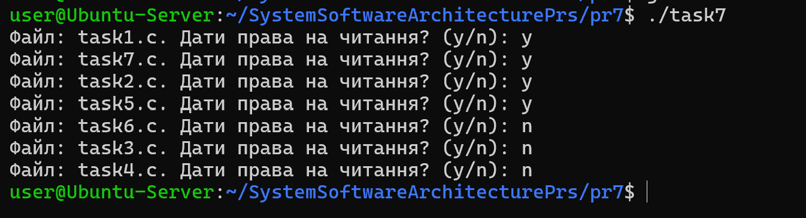

Програма проходить по файлах у каталозі та знаходить ті, що мають розширення .c. Для кожного такого файлу користувачу пропонується вибір — змінити права доступу чи ні.

У разі підтвердження використовується chmod(), щоб додати право читання для інших користувачів.

## Завдання 8

Напишіть програму, яка надає користувачу можливість видалити будь-який або всі файли у поточному робочому каталозі. Має з’являтися ім’я файлу з запитом, чи слід його видалити.

## _Результати_

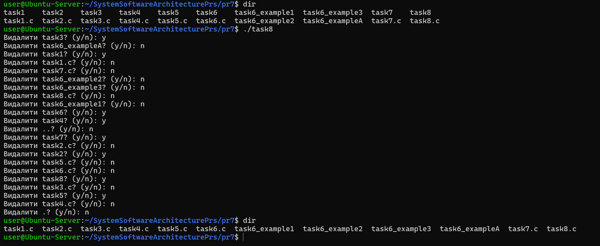

Програма переглядає всі файли у каталозі та для кожного виводить запит на видалення. Якщо користувач підтверджує дію, файл видаляється за допомогою функції remove().

## Завдання 9

Напишіть програму на C, яка вимірює час виконання фрагмента коду в мілісекундах.

## _Результати_

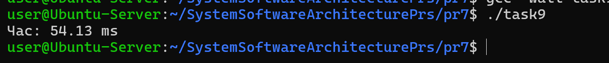

У програмі використано функцію clock() для вимірювання часу виконання. Фіксується час до і після виконання фрагмента коду, після чого обчислюється різниця.

Отриманий результат переводиться у мілісекунди та виводиться користувачу.

## Завдання 10

Напишіть програму мовою C для створення послідовності випадкових чисел з плаваючою комою у діапазонах:
 (a) від 0.0 до 1.0
 (b) від 0.0 до n, де n — будь-яке дійсне число з плаваючою точкою.
 Початкове значення генератора випадкових чисел має бути встановлене так, щоб гарантувати унікальну послідовність.
Примітка: використання прапорця -Wall під час компіляції є обов’язковим.

## _Результати_

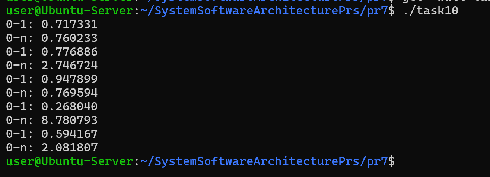

Програма використовує генератор випадкових чисел rand(), який ініціалізується за допомогою srand(time(NULL)), що забезпечує унікальність послідовності.

Було реалізовано генерацію чисел у діапазонах від 0 до 1 та від 0 до довільного числа n.

# Завдання по Варінатах ( Варіант 1)

## Завдання 1

Напишіть програму, яка визначає структуру ієрархії директорій для поточного користувача, починаючи з кореня, виключаючи циклічні посилання, але зберігаючи символьні.

## _Результати_

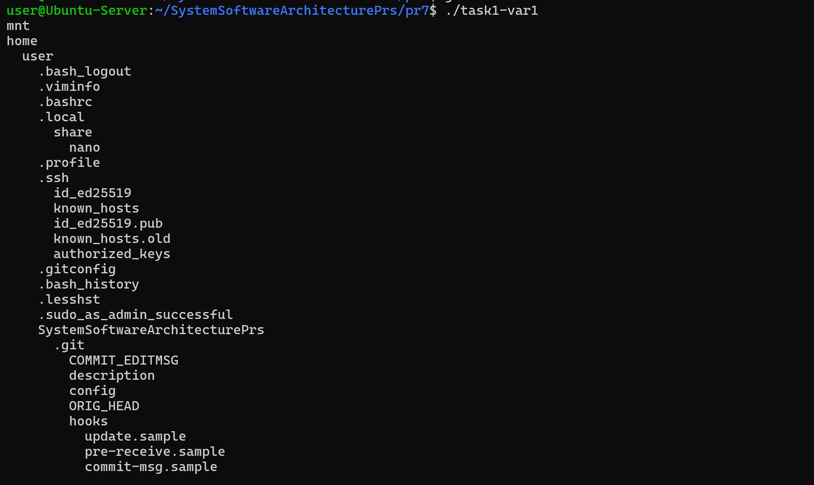

Було реалізовано рекурсивний обхід файлової системи з використанням lstat(), що дозволяє коректно працювати із символічними посиланнями.

Програма ігнорує службові каталоги "." та "..", що запобігає зацикленню. У результаті виводиться повна ієрархія директорій у вигляді дерева.