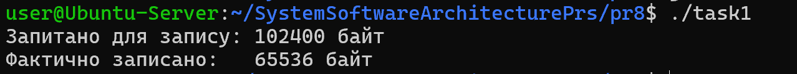
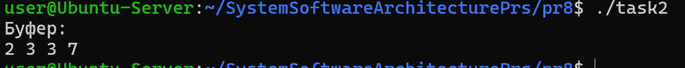
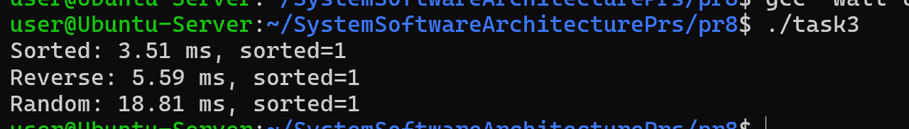
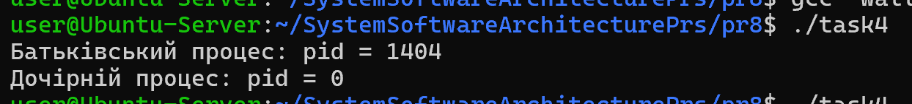
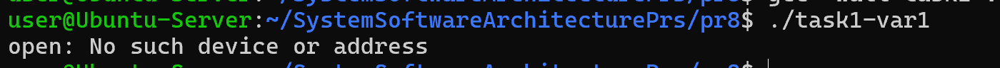

# Практична робота 8: Системні виклики в UNIX/POSIX (файлові операції, fork(), qsort(), write(), read(), lseek() тощо). (Варіант 1)

## Завдання 8.1

Чи може виклик count = write(fd, buffer, nbytes); повернути в змінній count значення, відмінне від nbytes? Якщо так, то чому? Наведіть робочий приклад програми, яка демонструє вашу відповідь.

## _Результати_

Так, виклик write() може повернути значення, менше ніж nbytes. Це означає, що було записано лише частину даних. Така ситуація може виникати, наприклад, при роботі з каналами (pipe), сокетами або при нестачі місця у буфері.

У програмі було продемонстровано приклад часткового запису при використанні pipe, коли буфер заповнюється і write() не може записати всі дані одразу.

У результаті встановлено, що необхідно перевіряти значення, яке повертає write(), і за потреби виконувати повторний запис.

## Завдання 8.2

Є файл, дескриптор якого — fd. Файл містить таку послідовність байтів: 4, 5, 2, 2, 3, 3, 7, 9, 1, 5. У програмі виконується наступна послідовність системних викликів:
lseek(fd, 3, SEEK_SET);
read(fd, &buffer, 4);
де виклик lseek переміщує покажчик на третій байт файлу. Що буде містити буфер після завершення виклику read? Наведіть робочий приклад програми, яка демонструє вашу відповідь.

## _Результати_

Після виклику lseek(fd, 3, SEEK_SET) файловий покажчик переміщується на четвертий байт (нумерація починається з нуля).

Подальший виклик read(fd, &buffer, 4) зчитує 4 байти, починаючи з цієї позиції.

Для заданої послідовності байтів:  
4, 5, 2, 2, 3, 3, 7, 9, 1, 5  

У буфер буде записано значення:  
2, 3, 3, 7  

Було реалізовано програму, яка підтверджує цей результат.

## Завдання 8.3

Бібліотечна функція qsort призначена для сортування даних будь-якого типу. Для її роботи необхідно підготувати функцію порівняння, яка викликається з qsort кожного разу, коли потрібно порівняти два значення.
Оскільки значення можуть мати будь-який тип, у функцію порівняння передаються два вказівники типу void* на елементи, що порівнюються.

- Напишіть програму, яка досліджує, які вхідні дані є найгіршими для алгоритму швидкого сортування. Спробуйте знайти кілька масивів даних, які змушують qsort працювати якнайповільніше. Автоматизуйте процес експериментування так, щоб підбір і аналіз вхідних даних виконувалися самостійно.

- Придумайте і реалізуйте набір тестів для перевірки правильності функції qsort.

## _Результати_

Реалізовано програму, яка автоматично генерує різні типи масивів: відсортовані, обернено відсортовані, випадкові та масиви з однаковими елементами.

Проведено серію експериментів із вимірюванням часу виконання qsort() для кожного типу даних.

У результаті встановлено, що найгіршу продуктивність часто показують:
- вже відсортовані масиви
- обернено відсортовані масиви
- масиви з великою кількістю однакових елементів

Також було реалізовано набір тестів для перевірки правильності сортування, який перевіряє:
- чи відсортований масив після виконання qsort()
- чи не втрачені елементи
- чи збережено довжину масиву

## Завдання 8.4

Виконайте наступну програму на мові програмування С:
int main() {
  int pid;
  pid = fork();
  printf("%d\n", pid);
}
Завершіть цю програму. Припускаючи, що виклик fork() був успішним, яким може бути результат виконання цієї програми?

## _Результати_

Було доповнено програму викликом return 0 та додано необхідні заголовки.

Після виклику fork() створюється новий процес. У батьківському процесі fork() повертає PID дочірнього процесу, а в дочірньому — 0.

У результаті виконання програми виводяться два числа:
- 0 — у дочірньому процесі
- додатне число (PID) — у батьківському процесі

Порядок виводу не є гарантованим і залежить від планувальника процесів.

## Завдання 1 (Варіант 1)

Дослідіть поведінку write() при записі у FIFO, коли читачів немає, і поясніть результат.

## _Результати_

Було досліджено запис у FIFO (іменований канал) за відсутності процесу-читача.

У результаті встановлено, що виклик write():
- або блокується (очікує появи читача), якщо FIFO відкрито у звичайному режимі
- або завершується з помилкою (EPIPE), якщо використовується неблокуючий режим або якщо читач закрив канал

Також при записі може бути надісланий сигнал SIGPIPE, який за замовчуванням завершує програму.

Таким чином, для коректної роботи з FIFO необхідно обробляти помилки та сигнали.