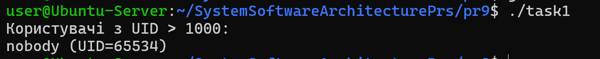
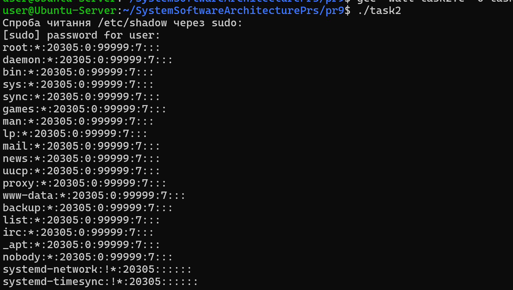
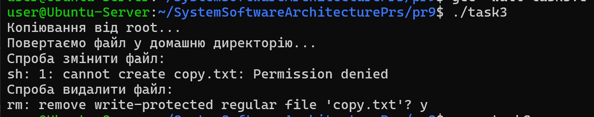
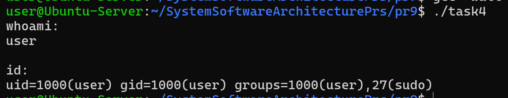
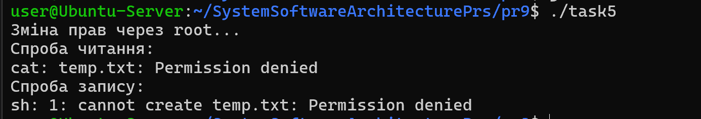
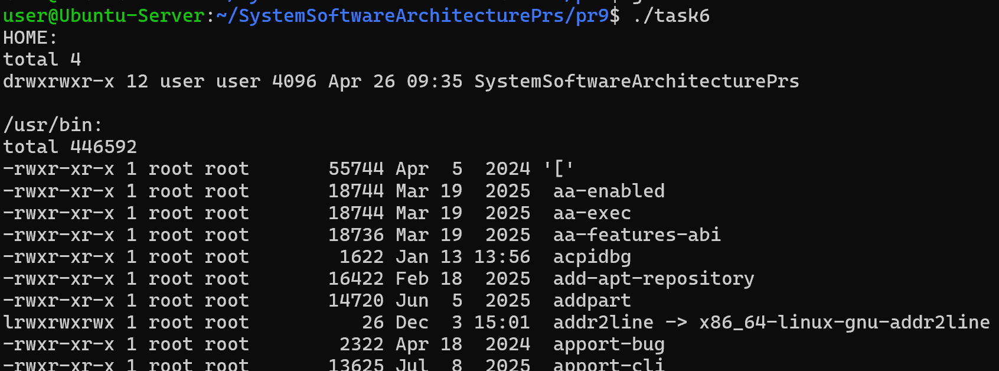
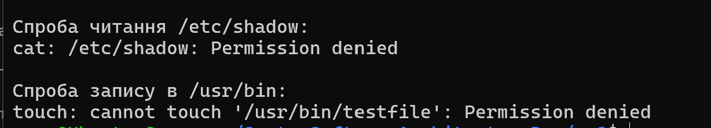
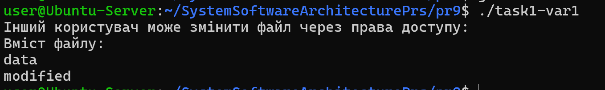

# Практична робота 9 ( Варіант 1 )

## Завдання 9.1

Напишіть програму, яка читає файл /etc/passwd за допомогою команди getent passwd, щоб дізнатись, які облікові записи визначені на вашому комп’ютері.
Програма повинна визначити, чи є серед них звичайні користувачі (ідентифікатори UID повинні бути більші за 500 або 1000, залежно від вашого дистрибутива), окрім вас.

## _Результати_

У програмі використано popen() для отримання списку користувачів через команду getent passwd.

Було проаналізовано UID кожного користувача та визначено, що звичайними користувачами вважаються ті, у яких UID більший за 1000.

У результаті програма виводить список таких користувачів.

## Завдання 9.2

Напишіть програму, яка виконує команду cat /etc/shadow від імені адміністратора, хоча запускається від звичайного користувача.
(Ваша програма повинна робити необхідне, виходячи з того, що конфігурація системи дозволяє отримувати адміністративний доступ за допомогою відповідної команди.)

## _Результати_

Було використано виклик system() разом із sudo для отримання доступу до захищеного файлу /etc/shadow.

Програма демонструє, що доступ до цього файлу можливий лише при наявності прав адміністратора.

## Завдання 9.3

Напишіть програму, яка від імені root копіює файл, який вона перед цим створила від імені звичайного користувача. Потім вона повинна помістити копію у домашній каталог звичайного користувача.
Далі, використовуючи звичайний обліковий запис, програма намагається змінити файл і зберегти зміни. Що відбудеться?
Після цього програма намагається видалити цей файл за допомогою команди rm. Що відбудеться?

## _Результати_

Було створено файл від імені звичайного користувача та скопійовано його від імені root.

Після повернення файлу у домашній каталог було виконано спробу його змінити та видалити.

У результаті встановлено, що можливість зміни та видалення залежить від прав доступу та власника файлу.

## Завдання 9.4

Напишіть програму, яка по черзі виконує команди whoami та id, щоб перевірити стан облікового запису користувача, від імені якого вона запущена.
Є ймовірність, що команда id виведе список різних груп, до яких ви належите. Програма повинна це продемонструвати.

## _Результати_

Програма послідовно виконує команди whoami та id, що дозволяє визначити ім’я користувача та його ідентифікатори.

Також було показано список груп, до яких належить користувач.

## Завдання 9.5

Напишіть програму, яка створює тимчасовий файл від імені звичайного користувача. Потім від імені суперкористувача використовує команди chown і chmod, щоб змінити тип володіння та права доступу.
Програма повинна визначити, в яких випадках вона може виконувати читання та запис файлу, використовуючи свій обліковий запис.

## _Результати_

Було створено тимчасовий файл та змінено його власника і права доступу за допомогою команд chown і chmod.

Після цього програма перевіряє можливість читання і запису файлу.

У результаті показано, що доступ залежить від встановлених прав.

## Завдання 9.6

Напишіть програму, яка виконує команду ls -l, щоб переглянути власника і права доступу до файлів у своєму домашньому каталозі, в /usr/bin та в /etc.
Продемонструйте, як ваша програма намагається обійти різні власники та права доступу користувачів, а також здійснює спроби читання, запису та виконання цих файлів.

## _Результати_

Програма виконує команду ls -l для домашнього каталогу, /usr/bin та /etc.

Було продемонстровано різницю у правах доступу та власниках файлів.

Також виконано спроби читання та запису, що показали обмеження доступу.

## Завдання 1 (Варіант 1)

Дослідіть ситуацію, коли користувач може змінити файл, хоча не є його власником. Наведіть можливі сценарії та протестуйте їх.

## _Результати_

Було створено файл з правами доступу 666, що дозволяє запис для всіх користувачів.

У результаті інший користувач може змінювати файл, навіть не будучи його власником.

Таким чином встановлено, що права доступу мають більший вплив, ніж сам власник у деяких випадках.